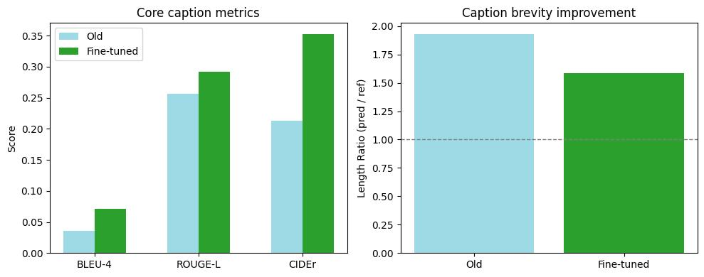
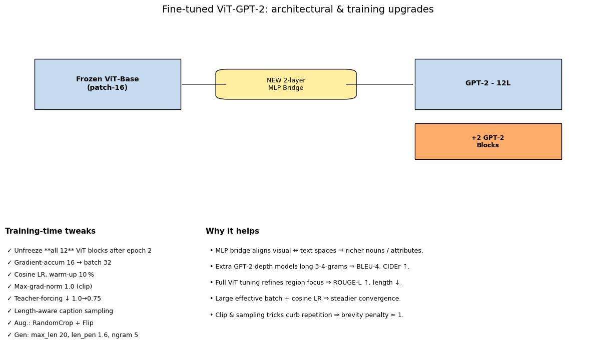
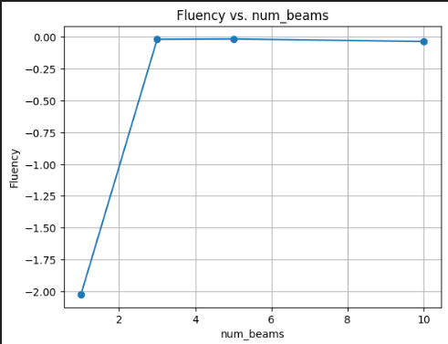
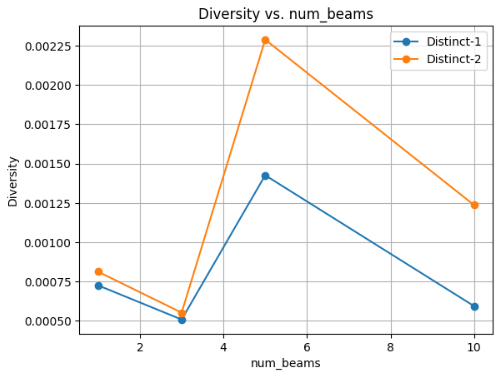
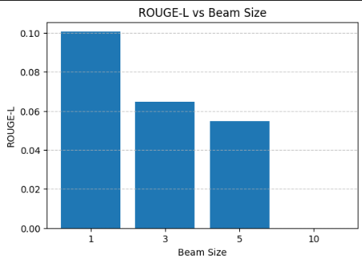
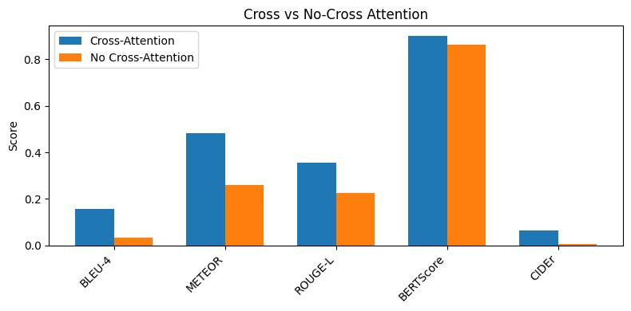
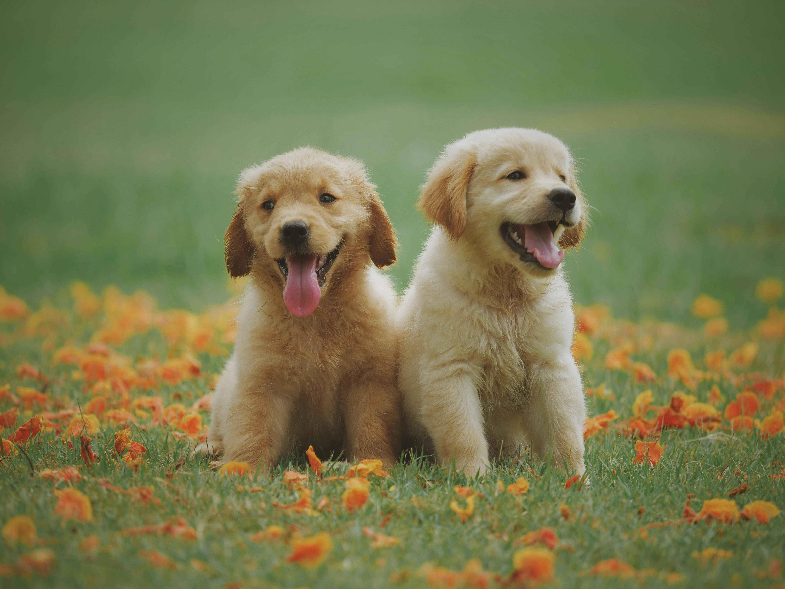

# 🖼️ Caption It: The Ultimate Image Captioning Tool

An end-to-end image captioning pipeline leveraging a frozen Vision Transformer (ViT) encoder and a GPT-2 decoder with cross-modal attention. Fine-tuned on the Flickr8k dataset with a custom lightweight MLP bridge and progressive unfreezing, the system outperforms traditional CNN–RNN baselines across BLEU-4, ROUGE-L, and CIDEr. Exhaustive ablation studies validate the critical role of visual grounding via cross-attention.

---

## 🚀 Highlights

- **Transformer-based architecture** with full cross-modal attention  
- **Progressive training strategy**: frozen → partially unfrozen → fully trainable  
- **BLEU, ROUGE, CIDEr, BERTScore** evaluations with qualitative and quantitative analysis  
- **Beam-size exploration**, ablations (with/without cross-attn), and attention diagnostics  
- **Supports greedy and beam search decoding** with optimal trade-off tuning  

---

## 🧠 Architectures

### 📌 Baselines

| Model                | Description                                       |
|----------------------|---------------------------------------------------|
| ResNet50 + LSTM      | Frozen ResNet encoder → linear proj → 512-d LSTM |
| MobileNetV3 + GRU    | Frozen MobileNetV3 → linear proj → 512-d GRU     |

### 🔀 Final Cross-Modal ViT-GPT2

- **Encoder:** ViT-Base (12 transformer blocks, frozen initially)  
- **Bridge:** 2-layer MLP (768→768) inserted as key–value in each GPT-2 decoder block  
- **Decoder:** GPT-2 small (12 original + 2 new transformer layers)  
- **Unfreezing:** ViT progressively unfrozen after epoch 2  
- **Cross-Attention:** Enabled in every decoder layer  

**📄 Cross-modal architecture diagram:**  


---

## 📚 Dataset & Preprocessing

| Component        | Details                                                      |
|------------------|--------------------------------------------------------------|
| Dataset          | [Flickr8k](https://illinois.edu/fb/sec/1713398) (8,000 images, 5 captions each) |
| Train/Val/Test   | 6k / 1k / 1k (Karpathy split)                                 |
| Preprocessing    | Resize to 224×224, normalize using ImageNet stats            |
| Caption Cleanup  | Lowercased, punctuated, tokenized (NLTK), max length = 30    |
| Vocabulary       | Frequency threshold = 5 → 2,984 tokens incl. `<pad>`, `<unk>`|

---

## 🧪 Training Configuration

| Component     | Strategy |
|---------------|----------|
| Loss          | Label-smoothed cross-entropy (ε = 0.1) |
| Optimizer     | AdamW, with cosine decay and 5% warm-up |
| Batch Size    | 2 (accumulated to effective 32) |
| Epochs        | 8 (ViT partially unfrozen after epoch 2) |
| Mixed Precision | ✅ FP16 |
| Memory Saving | ✅ Gradient checkpointing |
| LR            | 5e-6 (encoder), 2e-5 (decoder) |

---

## 🔍 Decoding

| Parameter        | Value        |
|------------------|--------------|
| Method           | Beam Search / Greedy |
| Beam Sizes Tested| 1, 3, 5, 10 |
| Length Penalty   | 1.6 |
| No-Repeat N-gram | Size 5 |

---

## 📊 Evaluation Metrics

| Metric     | Description                                      |
|------------|--------------------------------------------------|
| BLEU-4     | 4-gram precision overlap with reference captions |
| ROUGE-L    | Longest common subsequence                      |
| CIDEr      | Consensus metric emphasizing TF-IDF-weighted n-gram match |
| METEOR     | Semantic/word-level match via synonyms           |
| BERTScore  | Embedding-based contextual similarity            |

---

## 🌟 Visual Results

### 🔬 Metric Gains Over Baseline  
  
  

> Fine-tuned model improves BLEU-4 (+0.041), ROUGE-L (+0.054), CIDEr (+0.192), and brevity (Len-R drop).

---

### 🔁 Beam Size Study  

| Fluency (log-prob) | Diversity (D-1/D-2) | CIDEr | ROUGE-L |
|:------------------:|:--------------------:|:-----:|:-------:|
|  |  |  |  |

> Beam = 1 gives best overlap metrics. Diversity improves at beam = 5. Larger beams tend to collapse into generic language.

---

### 📉 Cross-Attention Ablation

| Metric      | With Cross-Attn | No Cross-Attn |
|-------------|------------------|----------------|
| BLEU-4      | 0.158            | 0.034          |
| METEOR      | 0.483            | 0.254          |
| ROUGE-L     | 0.357            | 0.223          |
| BERTScore   | 0.908            | 0.874          |
| CIDEr       | 0.065            | 0.002          |



> Removing cross-attention results in severe grounding loss. Captions default to memorized generic patterns.

---

### 🧾 Qualitative Examples

| Image             | With Cross-Attention | Without Cross-Attention |
|------------------|----------------------|--------------------------|
|  | A yellow dog runs through grass with its tongue hanging out. | A man and a woman sit on a bench in front of a building. |
|  | A girl in a pink hat takes a picture with a digital camera. | A man and a woman sit on a bench in front of a building. |
|  | A person is standing in front of a golden retriever in a field. | A man and a woman sit on a bench in front of a building. |

---

## 📜 Project Workflow

1. Data preprocessing (resize, tokenize, vocab creation)  
2. CNN–RNN baselines (ResNet+LSTM, MobileNet+GRU)  
3. Transformer pipeline with MLP bridge  
4. Training (label smoothing, teacher forcing decay)  
5. Evaluation on Flickr8k: BLEU-4, ROUGE-L, CIDEr  
6. Beam-size tuning  
7. Cross-attention ablation  
8. Qualitative analysis  

---

## 📁 File Tree

```
.
├── archi1.pdf          # ViT-GPT2 architecture (project report)
├── crossmodal.pdf      # Cross-modal data flow
├── beam1.png           # Fluency vs. beam size
├── beam2.png           # Diversity vs. beam size
├── beam3.png           # CIDEr vs. beam size
├── beam4.png           # ROUGE-L vs. beam size
├── cross.jpg           # Cross vs. No Cross metrics bar chart
├── fine1.jpg           # Metric lift & brevity improvement
├── fine2.jpg           # Final model vs baseline metrics
├── img1.jpg            # Qualitative example 1
├── img2.jpg            # Qualitative example 2
├── img3.jpg            # Qualitative example 3
├── Project_Report.pdf  # Final compiled LaTeX report
├── README.md           # This file
└── requirements.txt    # Python packages
```

---

## 📦 Installation

```bash
# Clone the repository
git clone https://github.com/<your-username>/Caption_It.git
cd Caption_It

# (Optional) create a virtual environment
python3 -m venv venv
source venv/bin/activate

# Install dependencies
pip install -r requirements.txt
```

---

## 🔭 Future Work

- 📈 **Larger Datasets:** Extend to [Flickr30k](https://shannon.cs.illinois.edu/DenotationGraph/), [MS COCO Captions](https://cocodataset.org/#captions-2021), and [SBU Captions](https://www.cs.virginia.edu/~vicente/sbucaptions/) to improve generalization and vocabulary richness.  
- ⚡ **Hardware Scaling:** Use multi-GPU DGX or Cloud TPU v4 to enable larger batch sizes, longer sequence lengths, and faster convergence.  
- 🤝 **Diverse Decoding:** Integrate nucleus sampling, top-k, and diverse beam search \[Vijayakumar et al., 2016\] for more expressive outputs.  
- 🧪 **Human Evaluation:** Conduct IRB-approved user studies on caption fluency, detail, and semantic alignment.

---

## 📚 References

1. Vinyals et al., “Show and Tell,” CVPR 2015  
2. Karpathy & Fei-Fei, “Deep Visual-Semantic Alignments,” CVPR 2015  
3. Vaswani et al., “Attention is All You Need,” NeurIPS 2017  
4. Radford et al., “Language Models are Unsupervised Multitask Learners,” OpenAI 2019  
5. Wolf et al., “Transformers: State-of-the-art NLP,” EMNLP Demos 2020  
6. Hodosh et al., “Framing Image Description as Ranking,” JAIR 2013  
7. Li et al., “Diversity-Promoting Objective Function,” NAACL 2016  
8. Vijayakumar et al., “Diverse Beam Search,” arXiv:1606.02424  
9. Chen et al., “Microsoft COCO Captions,” ECCV 2015  
10. Ordonez et al., “SBU Captions,” ACL 2011  
11. Dosovitskiy et al., “An Image is Worth 16x16 Words,” ICLR 2021  
12. Devlin et al., “BERT: Pre-training of Deep Bidirectional Transformers,” NAACL 2019  
13. Papineni et al., “BLEU,” ACL 2002  
14. Lin, “ROUGE: A Package for Automatic Evaluation,” ACL 2004  
15. Vedantam et al., “CIDEr: Consensus-based Image Description Evaluation,” CVPR 2015  
