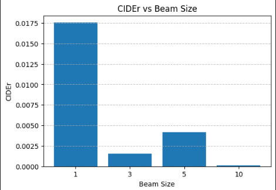

# Caption It: The Ultimate Image Captioning Tool

An end-to-end image captioning system that fuses a frozen Vision Transformer (ViT) encoder with a GPT-2 decoder via a lightweight MLP bridge and full cross-modal attention. Fine-tuned on Flickr8k, it achieves state-of-the-art BLEU-4, ROUGE-L and CIDEr scores while producing concise, well-grounded captions.

---

## 🚀 Features

- **Baselines**  
  - ResNet50 + LSTM (frozen encoder + LSTM decoder)  
  - MobileNetV3 + GRU (frozen encoder + GRU decoder)  

- **Cross-Modal Transformer**  
  - Frozen ViT-Base (`google/vit-base-patch16-224-in21k`)  
  - 2-layer MLP bridge (768 → 768)  
  - GPT-2 small decoder with cross-attention in every block  
  - +2 additional GPT-2 transformer blocks  
  - Progressive unfreezing of ViT layers  

- **Training Tricks**  
  - Label-smoothed cross-entropy (ε = 0.1)  
  - Teacher-forcing decay (1.0 → 0.75)  
  - Cosine-decay LR schedule with 5% warm-up  
  - Gradient checkpointing & mixed precision  

- **Decoding**  
  - Greedy or beam size ≤ 3 (optimal for fluency vs. diversity)  
  - No-repeat-ngram size = 5, length penalty = 1.6  

- **Ablations & Studies**  
  - Cross-attention vs. no cross-attention  
  - Beam-size sweep: fluency, diversity (Distinct-n), BLEU-4, ROUGE-L, CIDEr  

- **Qualitative Analysis**  
  - Grounding improvements with cross-attention  

---

## 📁 Repository Structure

```text
.
├── Architecture diagram 1.pdf    # Cross-modal ViT→GPT-2 architecture
├── beam1.png                     # Fluency vs. beam size
├── beam2.png                     # Diversity vs. beam size
├── beam3.png                     # CIDEr vs. beam size
├── beam4.png                     # ROUGE-L vs. beam size
├── cross.jpg                     # Cross vs. no cross-attention metrics
├── crossmodal.pdf                # Detailed cross-modal data flow
├── fine1.jpg                     # Metric lift & brevity improvement
├── fine2.jpg                     # Core metric comparison
├── img1.jpg                      # Qualitative example image 1
├── img2.jpg                      # Qualitative example image 2
├── img3.jpg                      # Qualitative example image 3
├── Project_Report.pdf            # Final LaTeX-generated project report
├── README.md                     # (this file)
└── requirements.txt              # Python dependencies
```

---

## 🛠️ Tech Stack

  
  
  

- **Frameworks:** PyTorch, HuggingFace Transformers  
- **Vision:** `timm`, `ViTImageProcessor`  
- **Visualization:** Matplotlib, Seaborn  
- **Dataset:** Flickr8k (6 000 train, 1 000 val, 1 000 test)

---

## 🌟 Key Visuals

### 1. Cross-Modal Architecture  
  
*Image preprocessed → ViT encoder → MLP bridge → GPT-2 decoder w/ cross-attention*

---

### 2. Metric Improvements  
  
  
*BLEU-4, ROUGE-L, CIDEr lift and brevity improvement vs. frozen baseline*

---

### 3. Ablation: Cross-Attention vs. No Cross-Attention  
  
*Ablation shows large performance drops without cross-modal attention*

---

### 4. Beam-Size Analysis  

| Fluency (log-prob) | Diversity (D-1/D-2) | CIDEr | ROUGE-L |
|:------------------:|:--------------------:|:-----:|:-------:|
|  |  |  |  |

*Fluency, diversity, CIDEr, and ROUGE-L vs. beam size*

---

### 5. Qualitative Examples  

| Image               | With Cross-Attention                                                         | No Cross-Attention                                      |
|---------------------|-------------------------------------------------------------------------------|---------------------------------------------------------|
|    | A person is standing in front of a golden retriever in a field.               | A man and a woman sit on a bench in front of a building.|
|    | A girl in a pink hat takes a picture with a digital camera.                   | A man and a woman sit on a bench in front of a building.|
|    | A yellow dog runs through grass with its tongue hanging out.                  | A man and a woman sit on a bench in front of a building.|

---

## 📜 Implementation Overview

1. **Data Preprocessing**  
   - Resize to 224×224, normalize (ImageNet stats)  
   - Tokenize captions, build vocab (threshold = 5)  

2. **Baselines**  
   - ResNet50 + LSTM, MobileNetV3 + GRU  

3. **Cross-Modal Model**  
   - Frozen ViT-Base → 2-layer MLP bridge → GPT-2 small w/ cross-attention  
   - +2 GPT-2 blocks, progressive unfreeze, label smoothing  

4. **Training**  
   - Cosine LR schedule, 5% warm-up, gradient accumulation, mixed precision  

5. **Evaluation**  
   - BLEU-4, ROUGE-L, CIDEr on Flickr8k test set  

6. **Ablations & Beam Study**  
   - Cross vs. no cross attention  
   - Beam-size sweep for fluency, diversity, overlap  

7. **Qualitative Analysis**  
   - Example captions demonstrating grounding improvements  

---

## 📦 Installation

```bash
# Clone repository
git clone https://github.com/<username>/Caption_It.git
cd Caption_It

# (Optional) create virtual env
python3 -m venv venv
source venv/bin/activate

# Install dependencies
pip install -r requirements.txt
```

---

## 🎯 Future Work

- **Scale to larger corpora:** Extend to Flickr30k, COCO Captions, and SBU Captions for improved generalization and vocabulary depth  
- **Advanced hardware:** Train using NVIDIA DGX A100 clusters or Google TPU v4s to allow larger batches and longer context windows  
- **Diversity-promoting decoding:** Implement nucleus sampling and diverse beam search to improve output richness without loss of grounding  
- **Human evaluation:** Conduct a 500-image IRB-approved user study comparing fluency, relevance, and detail

---

## 📄 License

Released under the MIT License.  
Feel free to fork, experiment, and cite.
