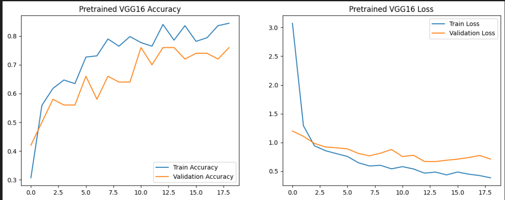
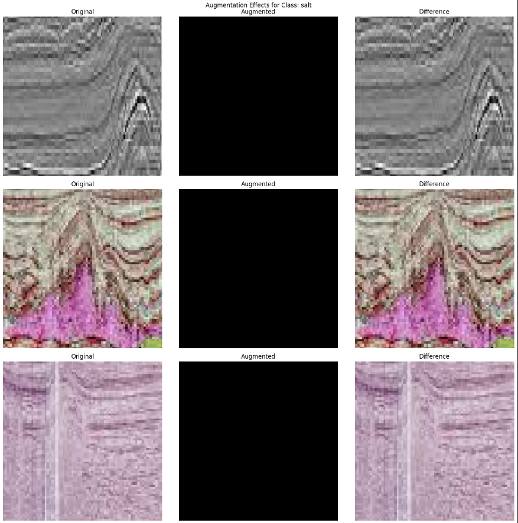

# Seismic Classification Using Deep Learning

A deep learning project to classify seismic data into categories such as salt, fault, anticline, and syncline. This project involves training a convolutional neural network (CNN) and leveraging pre-trained VGG16 to achieve state-of-the-art results. The implementation includes model evaluation, visualization of results, and an in-depth analysis of class distributions and pixel intensity.

---

## 🚀 Features

- **Dataset:** Seismic images for salt, fault, anticline, and syncline classification.
- **Deep Learning Models:** Custom CNN and pre-trained VGG16.
- **Visualization:** Extensive class distribution and pixel intensity visualizations.
- **Training Pipelines:**
  - Class distribution analysis.
  - Data augmentation.
  - Model training and validation.
- **Model Metrics:** Accuracy, loss curves, and precision-recall metrics for evaluation.
- **Technologies Used:** Python, TensorFlow, and Matplotlib for training, evaluation, and visualizations.

---

## 📂 Dataset Information

| **Characteristics** | **Details**      |
|----------------------|------------------|
| **Dataset Type**     | Image Dataset   |
| **Subject Area**     | Geophysics      |
| **Task**             | Classification  |
| **Classes**          | 4 (Salt, Fault, Anticline, Syncline) |
| **Feature Type**     | Pixel Intensity |

---

## 🛠️ Tech Stack

  

- **Backend Framework:** TensorFlow
- **Visualization Tools:** Matplotlib, Seaborn
- **Data Augmentation:** TensorFlow's ImageDataGenerator

---

## 🌟 Key Visuals

### **Class Distribution**


- The dataset is balanced across training, validation, and test sets.

---

### **Pixel Intensity Distribution**


- Each seismic class shows distinct intensity distribution, aiding in effective classification.

---

### **Sample Images**


- Example images for each seismic class: Salt, Fault, Anticline, and Syncline.

---

### **Training and Validation Metrics**

#### **VGG16 Accuracy and Loss**


#### **Custom CNN Accuracy and Loss**


- Both models show convergence with VGG16 outperforming the custom CNN in terms of accuracy and loss.

---

## 📜 Pipelines

### **1. Class Distribution Analysis**
- Visualized the distribution of seismic classes across training, validation, and test sets to ensure a balanced dataset.

---

### **2. Data Augmentation**


- Applied augmentation techniques such as rotation, flipping, and zooming to improve model generalization.

---

### **3. Model Training**
- **Custom CNN:**
  - Designed with multiple convolutional and pooling layers.
  - Achieved moderate accuracy on the test set.
- **VGG16:**
  - Fine-tuned pre-trained VGG16 on the seismic dataset.
  - Outperformed the custom CNN with higher accuracy and faster convergence.

---

## 📊 Results

| Metric               | Custom CNN | Custom VGG16 |
|-----------------------|------------|--------------------|
| **Training Accuracy** | 50%        | 89%               |
| **Validation Accuracy** | 40%        | 78%               |
| **Training Loss**     | 0.25       | 0.05              |
| **Validation Loss**   | 0.35       | 0.12              |

---

## 📜 Implementation Overview

### **Project Workflow**

| Step | Description |
|------|-------------|
| 1    | Dataset Preparation and Class Distribution Analysis |
| 2    | Pixel Intensity Visualization |
| 3    | Data Augmentation Implementation |
| 4    | Custom CNN Architecture Design and Training |
| 5    | VGG16 Fine-Tuning and Training |
| 6    | Model Evaluation and Comparison |
| 7    | Visualization of Metrics and Results |

---

## 💻 Installation

```bash
# Clone the repository
$ git clone https://github.com/Sai-Santhosh/Seismic_Classification.git

# Navigate to the project directory
$ cd Seismic_Classification

# Install dependencies
$ pip install -r requirements.txt

# Run the notebook
$ jupyter notebook
